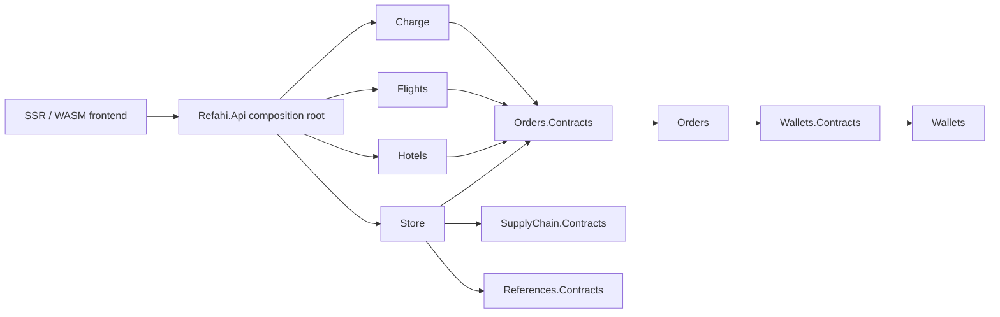
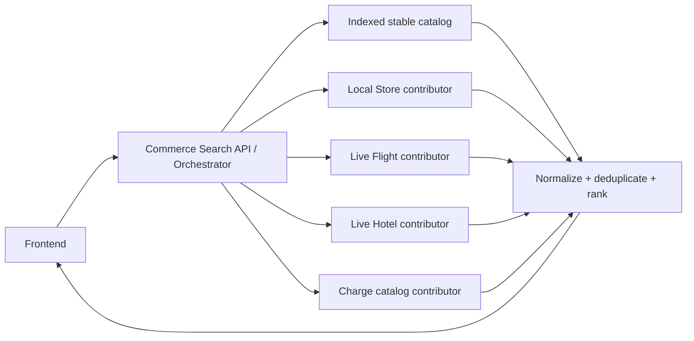
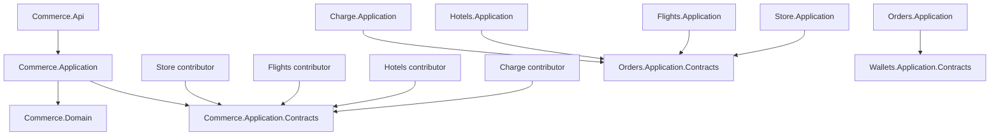
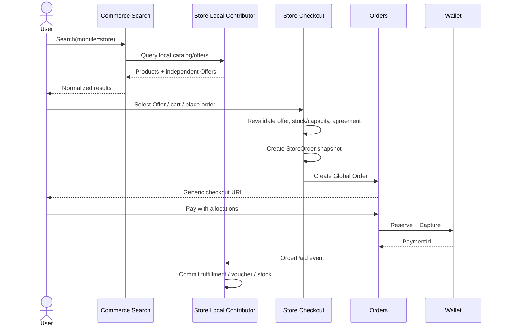
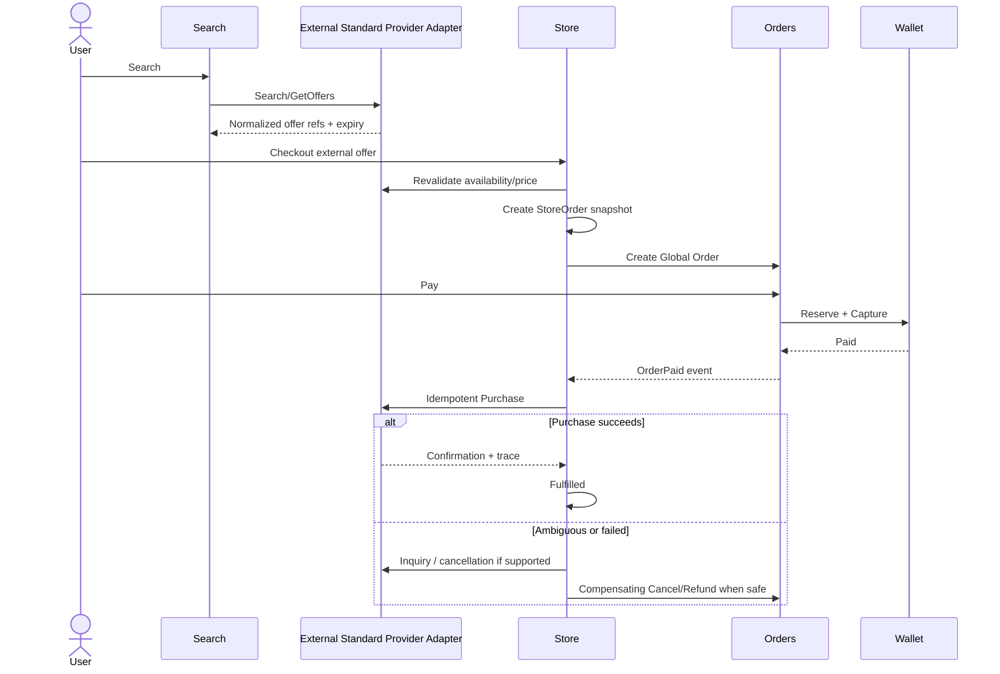
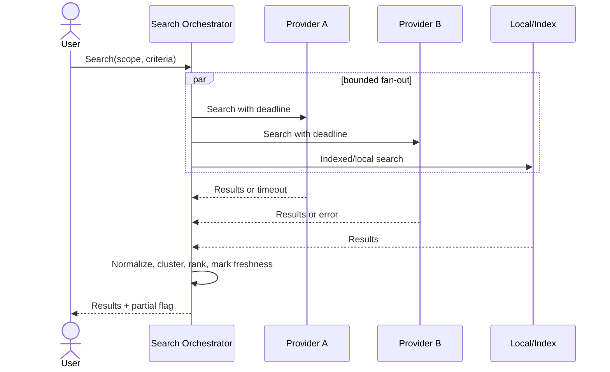
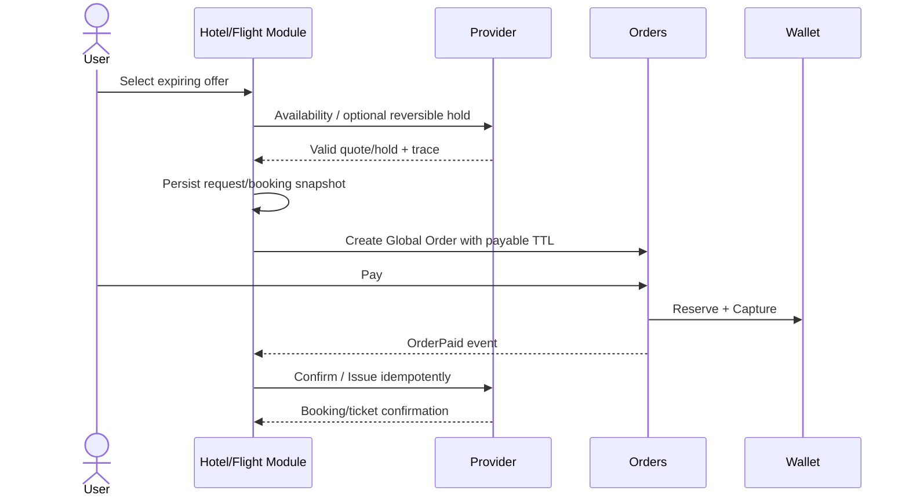
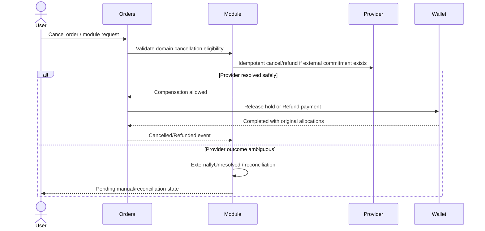

# Refahi Plus — Current Architecture vs Target Provider-Based Commerce Architecture

> تاریخ بررسی: 2026-08-15  
> محدوده: `refahiplus-api` به‌عنوان منبع اصلی، با بررسی محدود `refahiplus-webapp` برای coupling فرانت‌اند  
> نوع خروجی: Architecture Investigation؛ هیچ refactor یا تغییر اجرایی در کد انجام نشده است.

## راهنمای سطح اطمینان

- **Observed**: مستقیماً در کد، configuration، migration یا project reference دیده شده است.
- **Inferred**: از کنار هم گذاشتن چند شاهد کد استنباط شده و نیازمند تأیید تیم است.
- **Proposed**: معماری یا مسیر مهاجرت پیشنهادی است و هنوز در کد وجود ندارد.
- **Not found in repository**: در جست‌وجوی backend و، هرجا لازم بوده، frontend پیدا نشده است.

## 1. Executive Summary

### جمع‌بندی وضعیت فعلی

**Observed — Store اکنون واقعاً Offer-based است.** مدل محوری Store از چهار aggregate اصلی `Shop`، `Product`، `Offer` و `StoreOrder` به‌علاوه `Cart` تشکیل شده است. `Offer` یک رکورد persistent در schema `store` است و مختصات زیر را دارد:

```text
Supplier + Product + Shop + optional Variant + optional Session + validity window
```

`Offer` قیمت اصلی، درصد تخفیف، قیمت نهایی، بازه اعتبار، active/deleted state و optimistic concurrency token را نگه می‌دارد. migrationهای اخیر legacy pricing در `shop_products` و `shop_product_variants` را حذف کرده و مالکیت Offer را با composite foreign keyهای Supplier/Product/Shop/Variant/Session محکم کرده‌اند. بنابراین ساخت abstraction موازی دیگری برای Offer توجیه ندارد.

**Observed — Store مالک Vendor نیست.** مفهوم حقوقی/کسب‌وکاری تأمین‌کننده با نام `Supplier` در ماژول `SupplyChain` قرار دارد. Store فقط `SupplierId` نگه می‌دارد. اصطلاح Vendor در API و authorization به نقش کاربری/پنل فروشنده اشاره دارد، نه aggregate مالک‌شده توسط Store. رابطه واقعی فعلی چنین است:

```text
SupplyChain.Supplier
  ├─ Store.Shop*
  ├─ Store.Product*
  └─ Store.Offer*  (همان Supplier برای Product و Shop)
```

**Observed — Order decoupling فعلی صحیح و ارزشمند است.** `Orders.Domain.Order` فقط `SourceModule`، `SourceReferenceId`، `ReferenceType` و snapshotهای عمومی را نگه می‌دارد. `OrderItem` هیچ FK به `Store.Product` ندارد؛ در Store v3، `SourceItemId` به `StoreOrderItem.Id` اشاره می‌کند و جزئیات Offer/Product/Variant/Session در `MetadataJson` snapshot می‌شوند. Wallet فقط `OrderId` و allocationها را دریافت می‌کند و payment intent را reserve/capture/release/refund می‌کند.

**Observed — سه خانواده Provider مستقل وجود دارد.** Hotels، Flights و Charge هرکدام interface، factory/resolver و adapter خارجی خود را دارند:

- Hotels: `IHotelProvider` + `HotelProviderFactory` + `SnappTripHotelProvider`
- Flights: `IFlightProvider` + `FlightProviderFactory` + `SnappTripFlightProvider`
- Charge: `IChargeProvider` + `ChargeProviderResolver` + `EniacChargeProvider`

این‌ها نشان می‌دهند اصل Provider abstraction از قبل پذیرفته شده است؛ ولی interfaceها capability-oriented نیستند، registry مشترک ندارند و aggregation چند Provider در هیچ flow عمومی دیده نشد.

**Observed — Special Commerceها semantics خود را حفظ کرده‌اند.** Flight یک offer snapshot بیست‌دقیقه‌ای می‌سازد، قبل از Order در Provider `Book` می‌کند و پس از پرداخت `Issue` می‌کند. Hotel ابتدا `HotelRequest` و Global Order می‌سازد و پس از `OrderPaidIntegrationEvent` رزرو Provider را create/confirm می‌کند؛ failure با saga compensation و refund مدیریت می‌شود. Charge نیز پس از پرداخت، purchase را در worker انجام می‌دهد و ambiguity را با trace/reconciliation یا refund حل می‌کند.

**Observed — Global Search وجود ندارد.** Search فعلی module-specific است: Store روی PostgreSQL query می‌زند، Flight live provider search دارد، Hotel availability را مستقیم از Provider می‌گیرد و Charge catalog را از Eniac می‌خواند. index مشترک، global orchestrator، cross-provider ranking و deduplication پیدا نشد.

### پیشنهاد اصلی

**Proposed — Store نباید به God Commerce Engine تبدیل شود.** پیشنهاد این گزارش ایجاد یک bounded context مستقل و کوچک با نام کاری `Commerce` در کنار Store است، با همان پنج project اجباری. Commerce فقط قراردادهای capability، provider registry metadata، normalized discovery result و search orchestration را مالک می‌شود. Store همچنان مالک Standard Commerce، catalog محلی، Offer، Cart، StoreOrder و fulfillment خود باقی می‌ماند. Hotel/Flight/Charge نیز lifecycle دامنه‌ای خود را حفظ می‌کنند.

اصل طراحی:

> Share provider/discovery infrastructure and operational policies; do not share or flatten business semantics.

مهاجرت باید از استخراج metadata و قراردادهای read-only شروع شود، سپس یک Local Store contributor و فقط یک adapter خارجی pilot شود. Booking/Purchase/Cancel/Refund تا زمانی که حداقل دو implementation واقعی و semantics هم‌تراز ندارند، نباید به abstraction عمومی منتقل شوند.

## 2. Repository / Solution Overview

### 2.1 اسناد حاکم خوانده‌شده

**Observed** — اسناد زیر مطابق ترتیب اجباری خوانده شدند:

- `C:\Workspace\Refahi\docs\01-refahi-overview.md`
- `C:\Workspace\Refahi\docs\02-refahi-architecture.md`
- `C:\Workspace\Refahi\docs\rendering-governance-constitution.md`
- `C:\Workspace\Refahi\docs\page-rendering-inventory.md`
- `C:\Workspace\Refahi\docs\rendering-architecture-migration-report.md`

اسناد rendering وضعیت frontend را SSR برای discovery، WASM بدون prerender برای transaction و WASM island برای تعاملات موضعی تثبیت می‌کنند. این تصمیم با Search API واحد و provider-neutral سازگار است.

### 2.2 Solution و module boundaries

**Observed** — `Refahi.Backend.slnx` شامل host، Shared و یازده module پنج‌لایه است:

| Module | Projects | Schema / storage | نقش مرتبط با این تحلیل |
|---|---:|---|---|
| Charge | 5 | `charge` | catalog و fulfillment خارجی Eniac |
| Flights | 5 | `flights` | live search، offer snapshot، booking/issue |
| Hotels | 5 | `hotels` | availability، request، saga، booking/cancel |
| Identity | 5 | `identity` | User و address ownership |
| Media | 5 | `media` | asset storage |
| Orders | 5 | `orders` | تنها payable aggregate |
| Organizations | 5 | organization persistence | سازمان‌ها |
| PaymentGateway | 5 | `payment_gateway` | top-up gateway adapters SEP/Jibit |
| References | 5 | `references` | Category/City/Province |
| Store | 5 | `store` | Standard Commerce و Offer catalog |
| SupplyChain | 5 | `supplychain` | Supplier و Agreement ownership |
| Wallets | 5 | `wallets` | ledger و PaymentIntent |

Composition root در `src/Refahi.Api/Program.cs` همه moduleها را register و با prefixهای `/api/{module}` map می‌کند.

### 2.3 dependencyهای مهم واقعی

**Observed** — project referenceهای کلیدی:

- `Store.Application` به Contracts ماژول‌های Identity، Orders، Wallets، References و SupplyChain وابسته است.
- `Store.Infrastructure` علاوه بر Store Domain به Orders/Wallets Contracts reference دارد، ولی evidence فعلی از Provider عمومی در آن وجود ندارد.
- `Orders.Application` به Wallets Contracts و برای read/integration به Hotels، Identity، SupplyChain و Store Contracts وابسته است.
- `Hotels.Application` و `Flights.Application` و `Charge.Application` به Orders Contracts وابسته‌اند.
- هیچ module مورد بررسی به Domain/Application/Infrastructure module دیگری reference مستقیم ندارد؛ ارتباط cross-module عمدتاً از `Application.Contracts` و MediatR می‌گذرد.

**Observed — deviationهای ساختاری محدود:** `SupplyChain.Infrastructure` و `Media.Infrastructure` به Application همان module reference دارند؛ این موضوع خارج از migration Provider است، ولی با dependency diagram سخت‌گیرانه سند معماری کاملاً هم‌راستا نیست و باید جداگانه audit شود.

## 3. Current Architecture

### 3.1 Overall Architecture

**Observed** — backend یک modular monolith روی .NET 10، Minimal API، MediatR، EF Core/PostgreSQL و schema-per-module است. write pathها عمدتاً EF Core هستند؛ Wallet برای عملیات atomic و readهای سنگین از Npgsql/Dapper استفاده می‌کند. cross-module flowها synchronous MediatR هستند و Orders برای domain eventهای مالی outbox دارد.

نمودار سطح بالا:



### 3.2 Store Module

#### Domain model

**Observed** — aggregate roots و entityهای مهم:

| نوع | مسئولیت | Evidence |
|---|---|---|
| `Shop` | فروشگاه متعلق به `SupplierId`، channel/type، location و lifecycle | `src/Refahi.Modules.Store.Domain/Aggregates/Shop.cs` |
| `Product` | catalog item متعلق به Supplier؛ category، type، sales model، fulfillment، variant/session | `src/Refahi.Modules.Store.Domain/Aggregates/Product.cs` |
| `Offer` | پیشنهاد فروش مستقل برای Product+Shop و optional Variant/Session با window قیمت | `src/Refahi.Modules.Store.Domain/Aggregates/Offer.cs` |
| `Cart` | سبد per user/per StoreModule؛ آیتم‌های offer-based و single-shop invariant | `src/Refahi.Modules.Store.Domain/Aggregates/Cart.cs` |
| `StoreOrder` | module order استاندارد؛ online/in-person، idempotency، Order link و snapshot items | `src/Refahi.Modules.Store.Domain/Aggregates/StoreOrder.cs` |
| `ProductVariant` | ترکیب attributeها، stock یا validity/capacity | `src/Refahi.Modules.Store.Domain/Entities/ProductVariant.cs` |
| `ProductSession` | تاریخ/ساعت، capacity، sold count و cancel/activation | `src/Refahi.Modules.Store.Domain/Entities/ProductSession.cs` |
| `StoreOrderItem` | snapshot تجاری و مالی Store؛ Offer/Product/Agreement/commission | `src/Refahi.Modules.Store.Domain/Entities/StoreOrderItem.cs` |
| `Voucher` family | fulfillment دیجیتال، redemption و refund override | `src/Refahi.Modules.Store.Domain/Entities/Voucher*.cs` |

سایر entityها: `Banner`, `DailyDeal`, `Review`, `ProductImage`, `ProductSpecification`, `VariantAttribute`, `VariantAttributeValue`, `ProductVariantCombination`, `CartItem`, `StoreModule`.

Enums: `ProductType`, `SalesModel`, `FulfillmentMethod`, `SalesChannel`, `ShopType`, `ShopStatus`, `StoreOrderStatus`, `VariantCapacityType`, `VoucherStatus`, `PricingMode`, `DeliveryType`, و enumهای Banner.

**Observed — Value Object مستقل در Store پیدا نشد.** snapshotها عمدتاً record هستند و entityها primitive property دارند.

#### Repositoryها و domain service

Repository interfaceها در `src/Refahi.Modules.Store.Domain/Repositories/` قرار دارند. هسته مرتبط با commerce عبارت است از:

- `IProductRepository`
- `IOfferRepository`
- `IPublicCatalogRepository`
- `IProductSessionRepository`
- `ICartRepository`
- `IStoreOrderRepository`
- `IStoreOrderMutationLock`
- `IShopRepository`

**Observed** — `OfferResolver.Select` پیشنهاد مؤثر را با window و ترتیب deterministic انتخاب می‌کند: پایان نزدیک‌تر، شروع جدیدتر، creation جدیدتر و سپس Id. Evidence: `src/Refahi.Modules.Store.Domain/Services/OfferResolver.cs`.

#### Application services

**Observed** — serviceهای کلیدی:

- `OnlineOfferEligibilityService`: هماهنگ‌سازی Offer، Product، Shop و Agreement eligibility.
- `StoreVariantCapacityService`: validation ظرفیت/usage date؛ در کد TODO صریح برای enforce اتمیک capacity وجود دارد.
- `StoreSalesModelRules`: قواعد مدل فروش.
- `StoreInPersonFinancialPlanner`: طرح مالی فروش حضوری.
- `DeliveryService`: قواعد تحویل.
- `ModuleResolver`: resolution از module slug.

مسیر: `src/Refahi.Modules.Store.Application/Services/`.

#### Commands, queries, handlers, validators

**Observed** — featureهای Store در Application به این خانواده‌ها تقسیم شده‌اند:

- Catalog و Offer CRUD/read: `Features/Catalog/`, قراردادهای `Products/Catalog/` و `Offers/`
- Cart offer-based: `Features/Cart/`, قراردادهای `Commands/Cart/` و `Queries/Cart/`
- Checkout: `Features/Checkout/PlaceStoreOrder`, `SuggestAllocations`, lifecycle handlers
- Shop، Module، Banner، DailyDeal، Review
- In-person sale، Vendor access/read، Voucher lifecycle

FluentValidation برای commandهای اصلی وجود دارد؛ نمونه‌ها `PlaceStoreOrderCommandValidator`, `AddOfferToCartCommandValidator`, `CatalogValidators` و `VoucherValidators` هستند. registration در `src/Refahi.Modules.Store.Application/DI.cs` با MediatR و assembly scanning انجام می‌شود.

#### DTO و mapping

**Observed** — public contracts در `src/Refahi.Modules.Store.Application.Contracts/` قرار دارند. mapping catalog عمدتاً دستی است، به‌خصوص `PublicCatalogMapping` در `PublicCatalogHandlers.cs`. AutoMapper یا mapping profile در Store پیدا نشد.

#### API endpoints

**Observed** — API Store با prefix `/api/store` و assembly scan هر `IEndpoint` map می‌شود (`src/Refahi.Modules.Store.Api/DI.cs`). خانواده‌های endpoint:

- Public/admin catalog و Offer: `Endpoints/Catalog/CatalogEndpoints.cs`
- Offer cart: `Endpoints/Cart/OfferCartEndpoints.cs`
- Checkout و allocation: `Endpoints/Checkout/`
- Modules، Shops، Categories، Banners، DailyDeals، Reviews
- Vendor POS/access/read/income wallet: `Endpoints/Vendor/`
- Vouchers: `Endpoints/Vouchers/VoucherEndpoints.cs`

Routeهای محوری flow آنلاین:

- `POST /api/store/{moduleSlug}/cart/items`
- `GET /api/store/{moduleSlug}/cart`
- `POST /api/store/{moduleSlug}/cart/reconfirm`
- `POST /api/store/{moduleSlug}/checkout/suggest-allocations`
- `POST /api/store/{moduleSlug}/checkout`

#### Persistence

**Observed** — `StoreDbContext` از schema `store` و configurationهای جداگانه استفاده می‌کند. `OfferConfiguration`:

- composite FK از `(ProductId, SupplierId)` به Product
- composite FK از `(ShopId, SupplierId)` به Shop
- composite FKهای Variant/Session به Product
- unique filtered index برای open-ended Offer روی coordinate
- check constraint قیمت، تخفیف و window
- PostgreSQL `xmin` برای concurrency

Evidence اصلی:

- `src/Refahi.Modules.Store.Infrastructure/Persistence/Context/StoreDbContext.cs`
- `src/Refahi.Modules.Store.Infrastructure/Persistence/Configurations/OfferConfiguration.cs`
- `src/Refahi.Modules.Store.Infrastructure/Migrations/20260813140841_Store_OfferOwnershipIntegrity.cs`
- `src/Refahi.Modules.Store.Infrastructure/Migrations/20260813142949_Store_RemoveLegacyProductOfferModels.cs`

### 3.3 Vendor / Shop / Product / Offer

**Observed — مدل واقعی با فرض اولیه prompt یک تفاوت مهم دارد:**

```text
SupplyChain.Supplier (مالک Vendor/Supplier profile)
  ├─ Store.Shop*      (SupplierId only; no cross-schema FK)
  ├─ Store.Product*   (SupplierId only)
  └─ Store.Offer*     (SupplierId + ProductId + ShopId + optional Variant/Session)
```

Store هیچ `Vendor` entity ندارد. `Supplier` در `src/Refahi.Modules.SupplyChain.Domain/Aggregates/Supplier.cs` مالک اطلاعات شخص حقیقی/حقوقی، برند، تماس و وضعیت تأیید است. Store از SupplyChain Contracts برای agreement/category term و vendor context استفاده می‌کند.

**Observed — Offer موجود نیاز اصلی multi-offer را پشتیبانی می‌کند:** هر Product می‌تواند در Shopهای مختلف Offer داشته باشد و هر coordinate در طول تاریخ Offerهای متوالی داشته باشد. محدودیت فعلی این است که Offer `ProviderKey`، external offer id، capability snapshot، provider version/etag و quote expiry جدا از `EndDateUtc` ندارد.

### 3.4 StoreOrder

**Observed** — `StoreOrder` برای flow آنلاین و حضوری یک module order واقعی است. invariantهای مهم:

- idempotency unique بر `(UserId, IdempotencyKey)`
- request fingerprint برای جلوگیری از reuse کلید با payload متفاوت
- online order فقط یک Shop و Supplier دارد
- `OrderId` unique و nullable است
- `StoreOrderItem` snapshot قیمت، Offer، Product، Variant/Session، CategoryCode، Agreement و commission را نگه می‌دارد
- lifecycle از PendingOrder به PendingPayment/Paid/Cancelled/Refunded/Failed می‌رود

**Observed** — `StoreOrder` به Global Order attach می‌شود، ولی Orders هیچ FK معکوسی به Store ندارد.

### 3.5 Global Order / Wallet / Payment

**Observed** — `Order` در `src/Refahi.Modules.Orders.Domain/Aggregates/Order.cs` تنها payable aggregate است. ایجاد توسط `CreateOrderCommand` انجام می‌شود. `OrderItem` در `src/Refahi.Modules.Orders.Domain/Entities/OrderItem.cs` snapshot-only است و EF configuration هیچ Product FK ندارد.

Flow پرداخت واقعی:

1. feature module یک module-specific record می‌سازد.
2. feature module `CreateOrderCommand` را از Orders Contracts ارسال می‌کند.
3. frontend generic checkout، `PayOrderCommand` را با allocationها فراخوانی می‌کند.
4. `PayOrderCommandHandler` در Orders ابتدا `CreatePaymentIntentCommand` را به Wallet می‌فرستد.
5. Wallet مبلغ را atomically reserve می‌کند؛ Orders `PaymentIntentId` را persist می‌کند.
6. Orders `CapturePaymentIntentCommand` را می‌فرستد و پس از موفقیت `PaymentId` را ثبت و Order را Paid/Confirmed می‌کند.
7. outbox، `OrderPaidIntegrationEvent` را به module مبدا می‌رساند.

Evidence:

- `src/Refahi.Modules.Orders.Application/Features/PayOrder/PayOrderCommandHandler.cs`
- `src/Refahi.Modules.Wallets.Application/Services/CreatePaymentIntentApplicationService.cs`
- `src/Refahi.Modules.Wallets.Application/Services/CapturePaymentIntentApplicationService.cs`
- `src/Refahi.Modules.Wallets.Infrastructure/Persistence/Atomic/PaymentAtomicWriter.cs`

Refund با `CancelOrderCommand` و `RefundPaymentCommand` انجام می‌شود و Wallet allocation اصلی را معکوس می‌کند. برای Store، pre-refund voucher checks نیز از `PrepareStoreOrderRefundCommand` عبور می‌کند.

### 3.6 Flight

**Observed — Search و Offer:** `SearchFlightsQueryHandler` default provider را صدا می‌زند، پاسخ را validate/normalize می‌کند و برای هر نتیجه یک `FlightOfferSnapshot` با token امن و TTL بیست دقیقه می‌سازد. snapshot شامل provider name، fare source code، search/trace id، public JSON و masked provider JSON است.

**Observed — Booking:** `CreateFlightBookingCommandHandler` snapshot را بازیابی می‌کند، `BookAsync` را روی provider اجرا می‌کند و `FlightBooking` با provider/fare/passenger/segment snapshot می‌سازد. provider booking id uniqueness بررسی می‌شود.

**Observed — Order:** `PrepareFlightOrderCommandHandler` یک Order با `SourceModule=Flight` و `SourceReferenceId=BookingId` می‌سازد. Order item metadata شامل provider، provider fare/book/trace id و route است.

**Observed — Fulfillment:** پس از پرداخت، frontend route issuing، `IssueFlightTicketCommandHandler` را فراخوانی می‌کند. Handler پرداخت Order را verify، ابتدا inquiry، سپس issue و inquiry مجدد انجام می‌دهد و ticket snapshot را persist می‌کند.

**Observed — Cancellation:** methodهای quote/submit cancellation در `IFlightProvider` و SnappTrip adapter وجود دارند و domain entity `CancellationRequest` نیز هست، اما application handler و API endpoint فعال برای cancellation پیدا نشد. frontend inventory نیز route لغو را unimplemented اعلام کرده است.

**Observed — Multi-provider:** factory enum-based است ولی فقط SnappTrip implementation دارد؛ search aggregation ندارد.

### 3.7 Hotel

**Observed — Search/availability:** `GetAvailabilityByCityQuryHandler` مستقیماً `IHotelProvider.GetAvailabilityByCity` را فراخوانی می‌کند. `SearchHotelsEndpoint.cs` قدیمی comment شده است. داده search به‌صورت live از SnappTrip می‌آید؛ index محلی hotel catalog دیده نشد.

**Observed — Request/Order:** `CreateHotelRequestCommandHandler` یک `HotelRequest` بیست‌دقیقه‌ای و `HotelBookingSagaState` می‌سازد. request provider name/id و snapshotهای search/hotel/room/guest/price را نگه می‌دارد. `ConvertHotelRequestToOrderCommandHandler` آن را به Order با `ReferenceType=HotelRequest` تبدیل می‌کند.

**Observed — post-payment booking:** `HotelOrderPaidEventHandler` پس از OrderPaid، `FinalizeHotelBookingAfterPaymentCommand` را اجرا می‌کند. این flow provider booking cache با request hash/idempotency دارد، provider create/confirm/status را انجام می‌دهد و در failure از `CancelOrderCommand` برای compensation/refund استفاده می‌کند. workerهای reconciliation و saga recovery نیز ثبت شده‌اند.

**Observed — cancellation:** `CancelProviderBookingCommandHandler` cancellation را با idempotency اجرا می‌کند و unsupported/failure را به `ExternallyUnresolved` تبدیل می‌کند.

**Observed — interface shape:** `IHotelProvider` یک God interface شامل cities، search، details، reviews، balance، create/lock/confirm/status/cancel است.

### 3.8 Recharge

**Observed** — module با نام `Charge` پیاده‌سازی شده است. `IChargeProvider` catalog، offers، eligibility، balance، purchase، trace و admin reports را در یک interface دارد. تنها adapter فعلی Eniac و mechanism آن REST/JSON با Bearer token است.

Flow:

```text
Provider catalog/offer → Preview quote → ChargeRequest → Global Order
→ Wallet payment → OrderPaid event → worker purchase
→ fulfilled OR reconciliation/trace OR refund/manual review
```

`ChargeRequest` provider product/cost/caption، markup، customer invoice، provider RRN/trace و lifecycle کامل را persist می‌کند. `ChargeFulfillmentProcessor` purchase غیرقابل retry را از trace/reconciliation جدا کرده است. `ChargeRefundProcessor` از `CancelOrderCommand` استفاده می‌کند، نه Wallet مستقیم.

### 3.9 Pool / Multi Provider Modules

**Not found in repository — Pool module مستقل وجود ندارد.** جست‌وجوی `Pool`, `Swimming` و `استخر` module/domain/API مستقلی پیدا نکرد.

**Inferred** — مدل `Product.SalesModel=SessionBased`، `ProductSession` و `ProductVariant` با validity/capacity در Store برای standard commerce خدمات زمان‌دار مانند استخر/تفریح طراحی شده است. این inference باید با product owner تأیید شود؛ نام Pool در کد وجود ندارد.

**Not found in repository — هیچ module تجاری با دو provider فعال و aggregation هم‌زمان پیدا نشد.** PaymentGateway دو provider SEP و Jibit دارد، اما آن یک gateway-selection precedent است، نه product/offer aggregation.

### 3.10 Current Search Architecture

| Scope | Current implementation | Data source | Aggregation/ranking |
|---|---|---|---|
| Store module | `PublicCatalogRepository` و `PublicCatalogHandlers` | PostgreSQL `store` + eligibility از SupplyChain | group by Product، min/max price؛ sort newest/price |
| Flight module | `SearchFlightsQueryHandler` | live SnappTrip REST | فقط یک provider؛ mapping و snapshot |
| Hotel module | `GetAvailabilityByCityQuryHandler` | live SnappTrip REST | فقط یک provider؛ pass-through DTO |
| Charge module | catalog endpoints/handlers | live Eniac REST | فقط یک provider |
| Airport reference | `FlightAirportRepository.SearchAsync` | local PostgreSQL seeded JSON | local normalized search |
| Global | **Not found in repository** | — | — |
| Provider-scoped public search | **Not found as a generic API** | — | — |

**Observed** — Store search با `Contains` روی Product title/description و Shop name اجرا می‌شود؛ full-text engine یا external search index دیده نشد. sort deterministic ولی relevance ranking واقعی وجود ندارد.

**Observed** — frontend به APIهای module-specific وصل است، نه provider-specific transport. نمونه‌ها `ProductService`, `AvailabilityService`, Flight application handlers و `ChargePurchaseApiService` در `refahiplus-webapp` هستند. بنابراین integration mechanism مخفی است؛ بااین‌حال Hotel request و Charge DTOها `ProviderName`/`ProviderProductId` را حمل می‌کنند و Flight UI provider caption را نمایش می‌دهد. این exposure برای traceability مفید است، ولی انتخاب Provider نباید به UI واگذار شود.

### 3.11 Current Provider Integrations

| Provider/source | Module | Mechanism | Abstraction/adapter | Capability فعلی | Resilience/observability |
|---|---|---|---|---|---|
| Local PostgreSQL Store | Store | EF Core/PostgreSQL | repositories؛ provider interface ندارد | catalog, offers, availability-like stock/capacity, cart, buy | xmin، advisory lock، validation |
| SnappTrip Hotel | Hotels | REST/JSON API key | `IHotelProvider` / `SnappTripHotelProvider` | search/details/availability/booking/status/cancel | Polly bulkhead/retry/circuit/timeout، saga workers |
| SnappTrip Flight | Flights | REST/JSON API key | `IFlightProvider` / `SnappTripFlightProvider` | search/book/issue/inquiry/cancel quote+submit | masked logging؛ policy تعریف شده ولی `.AddPolicyHandler` comment شده |
| Eniac | Charge | REST/JSON Bearer token | `IChargeProvider` / `EniacChargeProvider` | catalog/offer/eligibility/purchase/trace/admin | safe retry، audit table، metrics، workers، health check |
| SEP | PaymentGateway | REST | `IPaymentGatewayProvider` / SEP adapter | token/redirect/verify | HttpClient/Polly |
| Jibit | PaymentGateway | REST | همان interface / Jibit adapter | token/redirect/verify | HttpClient/Polly |

**Observed** — SOAP، SDK یا external DB commerce integration پیدا نشد.

## 4. Current Architecture Evidence

### 4.1 Evidence matrix

| ادعا | وضعیت | Evidence |
|---|---|---|
| Store Offer یک aggregate persistent است | Observed | `Store.Domain/Aggregates/Offer.cs`, `OfferConfiguration.cs` |
| Product/Shop/Offer به یک Supplier محدودند | Observed | composite FKs در `OfferConfiguration.cs` و migration ownership integrity |
| Store order قبل از Global Order ساخته می‌شود | Observed | `PlaceStoreOrderCommandHandler.Handle/ResumeAsync` |
| OrderItem به Product FK ندارد | Observed | `Orders.Domain/Entities/OrderItem.cs`, `OrderItemConfiguration.cs` |
| Wallet فقط Order را می‌پردازد | Observed | `PayOrderCommandHandler` → Wallet contracts |
| refund allocation توسط Wallet معکوس می‌شود | Observed | `RefundPaymentApplicationService`, `PaymentAtomicWriter` |
| Flight offer transient-only نیست و audit snapshot دارد | Observed | `FlightOfferSnapshot`, EF configuration |
| Hotel booking post-payment است | Observed | `HotelOrderPaidEventHandler`, finalize handler |
| Charge purchase post-payment و recoverable است | Observed | `ChargeOrderPaidEventHandler`, workers/processors |
| Provider capability contract مشترک وجود ندارد | Not found | جست‌وجوی Contracts/Shared؛ فقط interfaceهای module-specific |
| Global Search/Index وجود ندارد | Not found | جست‌وجوی Solution/API/Application |
| Pool module وجود ندارد | Not found | جست‌وجوی Solution/src/tests |

### 4.2 موارد موجود، partial و غایب

#### Already present

- Provider adapters و factory/resolver در Hotel/Flight/Charge
- Offer-first commerce در Store
- provider traceability و snapshot در Flight/Hotel/Charge
- Global Order و Wallet isolation
- idempotency در StoreOrder، Orders، Wallet، Hotel saga، Flight booking و Charge request
- retry/reconciliation patterns در Hotel و Charge
- normalized DTO mapping داخل هر module

#### Partial

- multi-provider factories وجود دارند ولی فعالانه فقط یک commerce provider در هر module register شده است.
- capability awareness در Charge policy و method sets دیده می‌شود، اما interface segregation وجود ندارد.
- search normalization داخل moduleها انجام می‌شود، ولی contract مشترک و cross-module aggregation ندارد.
- Store Offer provider-ready coordinates دارد، ولی external source metadata ندارد.
- cancellation در Hotel کامل‌تر، در Flight contract/domain موجود ولی application/API ناقص، و در Charge به trace/refund داخلی محدود است.
- resilience در Hotel فعال، در Flight تعریف ولی غیرفعال، و در Charge custom است.

#### Absent

- provider registry/discovery مشترک
- capability metadata قابل query
- global/module/provider scoped Search API مشترک
- indexed global search
- multi-provider fan-out/timeout budget/dedup/ranking
- normalized external Offer reference مشترک
- generic provider health/rate/quota telemetry contract

### 4.3 abstractionهایی که باید reuse شوند

- `Store.Offer` برای standard commerce؛ نه ساخت Offer موازی.
- `FlightOfferSnapshot` و `HotelRequest` snapshot strategy برای dynamic quoteها.
- `Order`/`OrderItem` snapshot و `SourceReferenceId` برای decoupling.
- Wallet PaymentIntent/idempotency/allocations برای همه paymentها.
- Hotel saga/provider booking cache و Charge reconciliation برای template عملیاتی.
- `IPaymentGatewayProviderFactory` به‌عنوان precedent registry چند implementation، نه به‌عنوان commerce contract.

### 4.4 بخش‌هایی که نباید تغییر کنند

- Only Orders are payable.
- Wallet نباید Hotel/Flight/Store/Charge را مستقیم بشناسد.
- OrderItem نباید FK به Product/Room/Flight/Provider entity بگیرد.
- Store Offer نباید با abstraction عمومی ضعیف‌تر جایگزین شود.
- Hotel/Flight/Charge lifecycle نباید داخل Store منتقل شود.
- Supplier ownership باید در SupplyChain باقی بماند.
- frontend SSR/WASM governance و URL-driven discovery state باید حفظ شود.

## 5. Target Architecture

### 5.1 Provider Layer

**Proposed** — یک module مستقل `Commerce` با پنج project اجباری ایجاد شود:

```text
Refahi.Modules.Commerce.Domain
Refahi.Modules.Commerce.Application.Contracts
Refahi.Modules.Commerce.Application
Refahi.Modules.Commerce.Infrastructure
Refahi.Modules.Commerce.Api
```

این module مالک business order یا Product نیست. مسئولیتش محدود است به:

- provider identity/metadata و enabled state
- capability declaration و operational policy
- normalized search result envelope
- search orchestration و provider-scope selection
- correlation، deadline budget، result diagnostics

adapterهای domain-specific در Infrastructure module مربوطه باقی می‌مانند. مثلاً SnappTrip flight adapter همچنان در Flights.Infrastructure است و از طریق contractهای Flight semantics را پیاده می‌کند؛ فقط یک search contributor کوچک می‌تواند Commerce contract را implement کند.

### 5.2 Capability-Oriented Provider Contracts

**Proposed — مرحله اول فقط read capabilities عمومی شوند:**

```csharp
public interface ICommerceSearchContributor
{
    ProviderDescriptor Descriptor { get; }
    Task<SearchContribution> SearchAsync(
        NormalizedSearchRequest request,
        SearchExecutionContext context,
        CancellationToken ct);
}

public interface IProviderHealthContributor { ... }
```

برای عملیات domain-specific، contractها باید در bounded context خود بمانند و interfaceهای فعلی به interfaceهای کوچک‌تر شکسته شوند:

```text
Flights: IFlightSearchProvider, IFlightBookingProvider,
         IFlightIssuingProvider, IFlightCancellationProvider

Hotels:  IHotelDiscoveryProvider, IHotelAvailabilityProvider,
         IHotelBookingProvider, IHotelCancellationProvider

Charge:  IChargeCatalogProvider, IChargeEligibilityProvider,
         IChargePurchaseProvider, IChargeTraceProvider,
         IChargeReportingProvider
```

**مرز مهم:** `IBookingProvider<BookRequest>` generic در Shared پیشنهاد نمی‌شود؛ semantics رزرو هتل و پرواز متفاوت است. اشتراک در operational envelope، provider descriptor، idempotency/correlation و diagnostics است، نه request business shape.

### 5.3 Offer

**Proposed** — سه نوع representation تفکیک شود:

1. `Store.Offer`: canonical persistent standard-commerce offer؛ همان مدل موجود.
2. `DynamicOfferSnapshot`: module-owned expiring quote برای Flight/Hotel و providerهای real-time؛ الگوی فعلی Flight.
3. `SearchOfferReference`: provider-neutral pointer در Search result، نه aggregate مالی.

فیلدهای افزوده اختیاری به Store Offer یا یک owned source record فقط هنگام onboarding external standard-commerce provider:

```text
SourceKind: Local | External
ProviderKey
ExternalOfferId
ExternalProductId
QuoteExpiresAtUtc
ProviderVersion / ETag
RawSnapshotHash
```

این metadata نباید Supplier ownership را جایگزین کند. `SupplierId` طرف قرارداد/مالک تجاری است؛ `ProviderKey` منبع integration است و ممکن است با Supplier یکی نباشد.

### 5.4 Commerce Capabilities

**Proposed** — Commerce orchestration فقط capabilityهای اعلام‌شده را expose کند. provider مجبور به پیاده‌سازی همه methodها نیست. Registry باید static/config-driven شروع شود، نه reflection/plugin loading پیچیده:

```text
ProviderDescriptor
  ProviderKey
  Module
  Enabled
  Priority
  Capabilities[]
  TimeoutBudget
  ResultFreshness
  ConfigurationVersion
```

Purchase/Booking orchestration همچنان توسط module انجام می‌شود. Commerce نباید به passenger، guest، mobile number، voucher یا flight segment semantics آگاه شود.

### 5.5 Search Orchestration

**Proposed** — یک API واحد با سه scope:

```text
GET /api/search?q=...                         # global
GET /api/search?q=...&module=store            # module
GET /api/search?q=...&module=flight&provider=snapptrip
```

مدل اجرا:



Hybrid strategy:

- indexed: Store Product/Shop، stable hotel metadata، airport/city/reference data
- live: flight fares، hotel availability/pricing، personalized charge offers
- result hydration: نتیجه indexed ابتدا؛ live sections با deadline محدود و partial-result metadata
- provider failure نباید کل global search را fail کند؛ response باید `partial=true` و diagnostics داخلی داشته باشد.

Ranking v1 باید rule-based و قابل توضیح باشد: exact match، module boost، availability، price freshness، provider priority، popularity. ML ranking در این migration ضروری نیست.

### 5.6 Order Integration

**Proposed** — flow عمومی همچنان این است:

```text
Module workflow → Module Order/Request/Booking → Global Order → Wallet
```

Provider operation placement بر اساس reversibility:

- reversible hold/book: قبل از Global Order مجاز است، با expiry و cancellation؛ شبیه Flight Book.
- irreversible buy/issue: پس از paid Order، با idempotency و compensation؛ شبیه Flight Issue و Charge Purchase.
- provider confirmation: پس از payment و با saga/reconciliation؛ شبیه Hotel.

Commerce module نباید Order را مستقیم برای همه moduleها بسازد. هر module snapshot/title/category/payable amount خود را تولید می‌کند و سپس Orders contract را فراخوانی می‌کند.

## 6. Current vs Target Gap Analysis

| # | موضوع | Current State | Target / Gap | Risk | Required Change | ضرورت |
|---:|---|---|---|---|---|---|
| 1 | Provider abstraction | سه abstraction module-specific | descriptor/envelope مشترک + contracts کوچک module-specific | Medium | interface segregation تدریجی | ضروری |
| 2 | Local provider | Store repository مستقیم | Local Store search contributor | Low | adapter read-only روی public catalog | ضروری برای aggregation |
| 3 | External provider | SnappTrip/Eniac adapters | همان adapterها با descriptor/capability | Low | facade سازگار، بدون rewrite | ضروری |
| 4 | Multi-provider/module | factory هست، aggregation نیست | چند contributor فعال | High | registry، fan-out، timeout، dedup | بعد از pilot |
| 5 | Capability model | method-set ضمنی/God interface | explicit capability metadata | Medium | split interface و registry | ضروری |
| 6 | Product search | module-specific | normalized search request/result | Medium | contributor contract | ضروری |
| 7 | Offer retrieval | Store persistent؛ Flight snapshot؛ Hotel live | unified reference، نه unified aggregate | Medium | envelope با expiry/source | ضروری |
| 8 | Availability | Store stock/capacity، Hotel live، Flight seats | domain-specific check interface | High | per-module capability | ضروری برای transaction |
| 9 | Booking/Purchase | module workflows جدا | حفظ workflow؛ operational contract مشترک محدود | Critical | idempotency/deadline contract | ضروری، نه generic semantics |
| 10 | Cancellation | Hotel کامل‌تر؛ Flight ناقص؛ Charge Order refund | capability per module + unresolved state | High | تکمیل Flight application/API | ضروری قبل از multi-provider buy |
| 11 | Refund | Wallet full refund؛ provider refund عمومی نیست | provider compensation + Wallet refund هماهنگ | Critical | saga policy و ordering | ضروری |
| 12 | Search orchestration | وجود ندارد | Commerce orchestrator | High | module/API جدید | ضروری برای global search |
| 13 | Global search | وجود ندارد | indexed + optional live sections | Medium | index projection/API | ضروری محصولی |
| 14 | Module search | موجود ولی ناهمگون | همان API با module scope | Low | routing/adapters | ضروری |
| 15 | Provider search | enum/factory داخلی | provider scope controlled | Medium | authorization/allowlist | Optional برای public UI |
| 16 | Offer normalization | mapping داخل module | common envelope + module payload | Medium | normalized contract | ضروری |
| 17 | Store Catalog | mature local DB query | preserve؛ contributor روی آن | Low | بدون migration اولیه | ضروری reuse |
| 18 | Store Offer | mature canonical Offer | حفظ + optional source metadata | Medium | additive columns/table در فاز بعد | conditional |
| 19 | StoreOrder | موجود و snapshot-rich | حفظ | Low | فقط provider refs در metadata | ضروری حفظ |
| 20 | ModuleOrder | StoreOrder/HotelRequest/FlightBooking/ChargeRequest | حفظ مستقل | Low | conventions/documentation | ضروری حفظ |
| 21 | Global Order | generic و decoupled | حفظ بدون Product FK | Low | شاید provider correlation metadata | ضروری حفظ |
| 22 | Wallet | Order-based | بدون تغییر semantics | Critical | فقط استفاده از contract فعلی | ضروری حفظ |
| 23 | Payment | reserve/capture/refund | حفظ؛ saga around provider op | Critical | compensation policies | ضروری |
| 24 | Frontend coupling | module API-aware؛ transport-hidden | Search API واحد؛ no provider mechanism | Medium | frontend search client | ضروری برای global |
| 25 | Backend coupling | module-specific factories | common metadata، module semantics | Medium | contracts و DI registration | ضروری |
| 26 | Module boundaries | عمدتاً سالم | Commerce مستقل؛ Store non-god | High | پنج project و contract-only refs | ضروری |
| 27 | Resilience | ناهمگون؛ Flight policy غیرفعال | operation-aware retry/timeout/circuit | High | shared policy conventions | ضروری |
| 28 | Observability | Charge قوی، Hotel/Flight partial | standard tags/metrics/audit | High | provider call envelope | ضروری |
| 29 | Provider config | appsettings enum/default | typed validated config + enable/priority | Medium | options/registry config | ضروری |
| 30 | Registry/discovery | factory switchها | config-driven descriptor registry | Medium | registry DB را دیرتر اضافه کنید | ضروری؛ DB registry Optional |

## 7. Architecture Decision Analysis

### A. Store به Commerce Engine مشترک تبدیل شود یا Commerce مستقل باشد؟

#### گزینه 1: تکامل Store به Shared Commerce

مزایا:

- Offer، Product، Cart و StoreOrder از قبل حاضرند.
- Local standard commerce سریع‌تر onboard می‌شود.
- migration اولیه کمتر است.

معایب:

- Hotels/Flights/Charge مجبور می‌شوند به vocabulary و lifecycle Store وابسته شوند.
- Store به module مرکزی با dependencyهای فراوان تبدیل می‌شود.
- Product/Shop semantics برای flight fare، hotel room و recharge package مصنوعی است.
- خلاف اصل data ownership و پنج‌لایه بودن bounded contextهاست.

#### گزینه 2: Commerce Platform مستقل کنار Store

مزایا:

- provider/search infrastructure بدون انتقال domain ownership مشترک می‌شود.
- Store به‌عنوان Local Standard Commerce adapter reuse می‌شود.
- special commerceها lifecycle خود را حفظ می‌کنند.
- dependency direction روشن و قابل تست می‌ماند.

معایب:

- module جدید و contract governance لازم دارد.
- خطر ایجاد abstraction زودهنگام وجود دارد.
- composition و registry باید با DI modular monolith هماهنگ شود.

**Decision — Proposed:** گزینه 2، ولی با scope بسیار کوچک. Commerce در فازهای نخست فقط Discovery/Search/Provider Metadata را پوشش دهد. generic purchase engine تا زمانی که حداقل دو standard-commerce provider واقعی الگوی یکسان نشان نداده‌اند ساخته نشود.

### B. Provider مالک Offer باشد یا آن را supply کند؟

**Decision — Proposed:** Provider Offer را supply می‌کند؛ bounded context مالک representation داخلی است. Store مالک `Store.Offer`، Flights مالک `FlightOfferSnapshot` و Hotels مالک snapshot در `HotelRequest` است. Provider فقط source identity و lifecycle خارجی را دارد. این تفکیک audit، replacement و عدم وابستگی domain به transport را حفظ می‌کند.

### C. Offer خارجی persist شود یا transient باشد؟

**Decision — Proposed:**

- dynamic pricing: snapshot کوتاه‌عمر persistent/cache با expiry، hash و provider trace؛ الگوی Flight مناسب است.
- پس از ورود به transaction: snapshot کامل و immutable در ModuleOrder/Request/Booking الزامی است.
- stable standard-commerce external offer: می‌تواند در Store Offer sync شود، مشروط به source metadata و freshness/version.
- raw response کامل فقط با masking، retention policy و نیاز audit ذخیره شود.

### D. Product مشترک بین Providerها لازم است؟

**Decision — Proposed:** برای شروع خیر. Offerهای providerها مستقل بمانند. deduplication در Search با `ResultClusterKey` یا mapping projection اختیاری انجام شود و مالکیت Product ایجاد نکند. canonical product تنها برای domainهای واقعاً پایدار مثل یک کالای SKUدار یا hotel identity و پس از اثبات نیاز ایجاد شود.

### E. interfaceهای Provider capability-oriented باشند؟

**Decision — Proposed:** بله، ولی در مرز domain. Search/health/diagnostics می‌توانند cross-domain envelope مشترک داشته باشند. Booking/Purchase/Cancel/Refund باید per-module interfaceهای کوچک باشند. هر operation جداگانه retry/idempotency semantics دارد؛ تقسیم صرفاً بر اساس CRUD کافی نیست.

### F. Search بخشی از Provider باشد یا Platform مستقل؟

**Decision — Proposed:** Provider یک search contributor است؛ orchestration/ranking/deduplication یک platform مستقل است. provider نباید global ranking یا UI shape را بداند.

### G. Global Search باید Indexed + Live باشد؟

**Decision — Proposed:** بله. PostgreSQL در فاز اول برای index projection کافی است؛ OpenSearch/Elasticsearch فعلاً ضروری نیست. live fan-out فقط برای query/moduleهایی اجرا شود که قیمت/availability real-time می‌خواهند. Store و reference data indexed/local هستند؛ Flight/Hotel live hydration دارند.

### H. Order decoupling چگونه حفظ شود؟

**Decision — Proposed:** هیچ FK جدیدی از Orders به Commerce/Provider/Product ایجاد نشود. ModuleOrder source-of-truth دامنه‌ای است؛ Global Order snapshot payable است؛ provider trace در module snapshot و در حد نیاز در Order metadata نگه داشته می‌شود. Wallet فقط OrderId، amount، currency، category codes و allocation/posting را می‌بیند.

## 8. Proposed Migration Roadmap

### Phase 0 — Discovery / Baseline

- هدف: قراردادهای فعلی، latency/error rate و flowها baseline شوند.
- معماری: ADR برای اصطلاحات Supplier/Provider/Vendor/Offer/Quote.
- پروژه‌ها: docs، Store، Hotels، Flights، Charge، Orders، Wallets.
- DB/API/frontend: بدون تغییر.
- compatibility: کامل.
- rollback: حذف docs/feature flags؛ بدون data rollback.
- ریسک: تعریف capability بیش از نیاز.
- Done: inventory provider operations، error taxonomy، SLO و contract tests موجود ثبت شده باشد.
- وابستگی: ندارد.

### Phase 1 — Provider Contracts and Registry Metadata

- هدف: descriptor و capability metadata مشترک، بدون تغییر flow.
- معماری: ایجاد پنج project `Commerce`؛ registry config-driven و read-only.
- فایل/پروژه: new Commerce projects، `Refahi.Backend.slnx`, composition root.
- DB: هیچ؛ config در appsettings/options.
- API: admin/internal endpoint برای descriptors و health summary، نه public purchase.
- frontend: هیچ.
- compatibility: factoryهای فعلی دست‌نخورده؛ facadeها کنار آن‌ها.
- rollback: disable registration/endpoint.
- ریسک: dependency cycle؛ با Contracts-only refs کنترل شود.
- Done: registry هر provider را با capability/timeout/enabled state برگرداند؛ build/test پاس شود.
- وابستگی: Phase 0.

### Phase 2 — Local Store Provider / Search Contributor

- هدف: Store اولین contributor بدون تغییر catalog/checkout باشد.
- معماری: adapter روی `IPublicCatalogRepository`/public query contracts، نه duplicate repository.
- پروژه‌ها: Commerce Contracts/Application، Store Application/Contracts؛ Infrastructure فقط در صورت نیاز registration.
- DB: بدون تغییر.
- API: Commerce module-scoped search پشت feature flag؛ API قدیمی Store فعال می‌ماند.
- frontend: shadow call یا internal comparison فقط.
- compatibility: response قدیمی canonical است.
- rollback: feature flag off.
- ریسک: mapping و pagination mismatch.
- Done: نتایج و sort با Store API در dataset ثابت هم‌ارز باشند.
- وابستگی: Phase 1.

### Phase 3 — Adapter برای یک External Provider

- هدف: Flight search به‌عنوان pilot read-only به orchestrator متصل شود.
- معماری: `IFlightSearchProvider` از God interface استخراج و SnappTrip adapter هر دو interface را موقتاً implement کند؛ Flight module result contributor بسازد.
- پروژه‌ها: Flights Contracts/Application/Infrastructure، Commerce Contracts/Application.
- DB: reuse `flight_search_offer_snapshots`؛ migration لازم نیست.
- API: Commerce module search می‌تواند flight را برگرداند؛ Flight API قدیمی باقی می‌ماند.
- frontend: ابتدا A/B یا feature flag.
- compatibility: same OfferToken به route فعلی Flight هدایت شود.
- rollback: contributor disable؛ Flight API مستقل.
- ریسک: duplicate provider calls و offer snapshots.
- Done: یک request فقط یک live call داشته باشد؛ TTL/trace preserved؛ timeout partial response تست شود.
- وابستگی: Phase 2.

### Phase 4 — Multi Provider Aggregation

- هدف: حداقل دو contributor واقعی در یک scope یا چند module در global result.
- معماری: bounded parallel fan-out، deadline budget، partial failure، dedup/cluster و deterministic rank.
- پروژه‌ها: Commerce Application/Infrastructure؛ module contributors.
- DB: optional query audit و provider health projection؛ PII-free.
- API: pagination token opaque؛ `partial`, `sources`, freshness metadata.
- frontend: نمایش result sections و degraded-state بدون provider transport details.
- compatibility: deep links به API/module flow فعلی.
- rollback: single-source priority mode.
- ریسک: latency tail، rate limit، duplicate result.
- Done: chaos tests برای timeout/429/5xx و stable ranking.
- وابستگی: حداقل دو contributor validated.

### Phase 5 — Indexed Search / Global Search

- هدف: global discovery سریع با live hydration انتخابی.
- معماری: projection/outbox consumers از Store و stable metadata؛ PostgreSQL full-text/trigram در v1.
- پروژه‌ها: Commerce Infrastructure، producer integration events در module contracts.
- DB: schema `commerce` برای search documents، source version و checkpoints.
- API: `/api/search` global/module/provider scopes.
- frontend: search box فقط به Search API؛ state در URL؛ SSR initial result مطابق rendering constitution.
- compatibility: module search APIها deprecated نمی‌شوند تا parity.
- rollback: indexed path off؛ module APIs یا local contributor.
- ریسک: stale index و ownership duplication.
- Done: lag SLO، replay/rebuild، zero cross-module CRUD ownership.
- وابستگی: Phase 4.

### Phase 6 — Standard Commerce External Provider Integration

- هدف: یک external provider با semantics واقعاً standard به Store checkout متصل شود.
- معماری: source metadata روی Store Offer یا owned `OfferSource`; capabilityهای availability/purchase/cancel کوچک.
- پروژه‌ها: Store همه لایه‌ها، Commerce Contracts، provider adapter Infrastructure.
- DB: additive columns/table، nullable و backfilled `SourceKind=Local`.
- API: Offer DTO source opaque؛ checkout همان route.
- frontend: بدون provider mechanism؛ شاید caption اختیاری.
- compatibility: local Offer default و flow موجود unchanged.
- rollback: external source disabled؛ migration additive حفظ شود.
- ریسک: price/availability drift، duplicate purchase.
- Done: revalidation، idempotent purchase، compensation، audit و contract tests.
- وابستگی: Phases 1–4؛ provider واقعی.

### Phase 7 — Special Commerce Capability Refactoring

- هدف: God interfaceهای Hotel/Flight/Charge split شوند، بدون انتقال workflow.
- معماری: interfaceهای capability-oriented per module؛ facade قدیمی موقت.
- پروژه‌ها: Contracts/Application/Infrastructure هر module.
- DB: معمولاً بدون تغییر؛ cancellation/refund state ممکن است additive باشد.
- API/frontend: routeها ثابت؛ Flight cancellation در صورت نیاز اضافه و در rendering inventory ثبت شود.
- compatibility: adapter قدیمی facade روی interfaceهای جدید.
- rollback: facade مسیر قدیمی.
- ریسک: lifecycle regression و provider ambiguity.
- Done: contract tests برای هر capability، reconciliation و cancellation کامل.
- وابستگی: تجربه pilot.

### Phase 8 — Deprecation / Cleanup

- هدف: حذف facadeها و pathهای duplicate پس از telemetry-backed parity.
- معماری: registry واحد metadata و policy conventions.
- DB: cleanup فقط پس از retention/backfill audit؛ destructive migration جداگانه.
- API: deprecation headers/version window.
- frontend: فقط Search API برای global discovery؛ module transactional APIs باقی.
- rollback: قبل از drop، release قبلی و DB backup؛ dual-read window.
- ریسک: consumer پنهان.
- Done: صفر traffic روی deprecated endpoints برای دوره توافق‌شده، runbook rollback و dashboards.
- وابستگی: همه فازهای فعال.

## 9. Risks and Mitigations

| ریسک | سطح | شواهد/علت | کاهش ریسک |
|---|---|---|---|
| Breaking changes | High | DTO/interfaceهای module-specific مصرف می‌شوند | facade، versioning، contract test، feature flag |
| Data migration | High | Store Offer و source metadata تاریخی | additive nullable migration، backfill audit، no early drop |
| Backward compatibility | High | frontend module APIs فعال‌اند | dual path و telemetry parity |
| Order consistency | Critical | module order و global order جدا persist می‌شوند | idempotency + unique source reference + saga/outbox |
| Payment consistency | Critical | capture ممکن است قبل از provider fulfillment موفق شود | compensation، reconciliation، persisted state machine |
| Duplicate purchase | Critical | retry پس از timeout نتیجه مبهم دارد | provider idempotency key، inquiry-before-retry، never blind retry purchase |
| Idempotency collision | High | key با payload متفاوت | request hash/fingerprint مانند Store/Hotel cache |
| Provider failure | High | external dependency | partial search، circuit/timeout، fallback، worker recovery |
| Timeout | High | live fan-out tail latency | per-provider + total deadline، cancellation propagation |
| Partial failure | High | چند contributor | partial response، source diagnostics، no total failure |
| Availability mismatch | High | search تا checkout فاصله دارد | revalidate immediately before commitment |
| Price mismatch | Critical | dynamic offer expiry | signed/opaque token، snapshot، user reconfirmation، payable TTL |
| Cancellation mismatch | Critical | external cancelled ولی local/Wallet نه یا برعکس | explicit saga states، reconciliation، manual review |
| Refund mismatch | Critical | provider refund و wallet refund دو سیستم‌اند | ordered compensation policy، idempotent steps، audit |
| Concurrency | High | Store capacity TODO، checkout هم‌زمان | advisory/distributed lock و atomic capacity reservation |
| Race condition | High | expiry vs reserve/capture | mutation lock، clock injection، eligibility recheck |
| Provider rate limit | High | fan-out global search | bulkhead، cache، quota، jitter، provider budget |
| Search duplication | Medium | چند source یک خدمت | cluster key؛ offerها مستقل بمانند |
| Stale data | High | index و cached dynamic offers | freshness metadata، TTL، live hydration |
| Provider schema change | High | mapperهای REST | tolerant parser، schema contract tests، raw masked sample fixtures |
| Observability gaps | High | Flight policy disabled، metrics ناهمگون | standard provider tags، latency/error/attempt/correlation |
| Sensitive payload leakage | Critical | guest/passenger/mobile/provider raw JSON | masking، allowlist snapshots، encryption/retention |
| Module boundary erosion | High | Commerce می‌تواند God module شود | explicit non-goals و architecture tests |

## 10. Recommended End State

### 10.1 Component ownership

| مفهوم | Owner پیشنهادی | نباید بداند |
|---|---|---|
| Supplier/Vendor business identity | SupplyChain | provider transport |
| Store Product/Shop/Offer/Cart/StoreOrder | Store | Hotel/Flight semantics |
| HotelRequest/booking saga | Hotels | Store cart/product |
| Flight offer snapshot/booking/ticket | Flights | Store Offer persistence |
| ChargeRequest/fulfillment | Charge | Store checkout |
| Provider descriptor/search orchestration | Commerce | passenger/guest/payment rules |
| Global payable Order | Orders | Product FK/provider SDK |
| Wallet ledger/payment intent | Wallets | feature module/provider |

### 10.2 Dependency direction



### 10.3 Non-goals

- یک Product aggregate جهانی برای همه domainها
- یک generic Booking DTO برای Hotel و Flight
- انتقال Order/Wallet/payment به Commerce
- حذف Store Offer
- merge کردن Offerهای providerهای مختلف در یک Offer مالی
- اتصال frontend به REST/SOAP/SDK provider
- dynamic plugin loading در فاز اول

## 11. Open Questions / Decisions Required

1. آیا `SupplierId` همیشه طرف قرارداد تجاری است و `ProviderKey` صرفاً integration source، یا بعضی external providerها خود Supplier هم هستند؟
2. اولین external standard-commerce provider واقعی کدام است؟ بدون این مورد Phase 6 نباید طراحی تفصیلی شود.
3. آیا نمایش provider caption به کاربر requirement است یا فقط trace داخلی؟
4. policy اختلاف قیمت در checkout چیست: auto-accept، tolerance یا user reconfirmation؟
5. آیا cancellation/refund جزئی لازم است؟ Wallet فعلی full refund را روشن‌تر پشتیبانی می‌کند.
6. SLO global search و budget هر live provider چیست؟
7. retention و encryption policy برای raw provider snapshotهای Hotel/Flight/Charge چیست؟
8. canonical deduplication برای hotel/product واقعاً لازم است یا grouping نمایشی کافی است؟
9. آیا provider-level search public است یا فقط admin/debug scope؟
10. ownership provider configuration با Operations است یا business admin و نیازمند DB registry؟

## 12. Proposed Flows

### Flow 1 — Local Standard Commerce



### Flow 2 — External Standard Commerce



> خرید irreversible نباید پیش از Order/Wallet payment انجام شود. اگر Provider hold رزروپذیر دارد، فقط hold موقت می‌تواند پیش از payment قرار گیرد.

### Flow 3 — Multi Provider Search



### Flow 4 — Reservation / Booking



### Flow 5 — Cancellation / Refund



## 13. Appendix — Relevant Files, Types and Interfaces

### Store core

- `src/Refahi.Modules.Store.Domain/Aggregates/Shop.cs` — `Shop`
- `src/Refahi.Modules.Store.Domain/Aggregates/Product.cs` — `Product`
- `src/Refahi.Modules.Store.Domain/Aggregates/Offer.cs` — `Offer`
- `src/Refahi.Modules.Store.Domain/Aggregates/Cart.cs` — `Cart`
- `src/Refahi.Modules.Store.Domain/Aggregates/StoreOrder.cs` — `StoreOrder`
- `src/Refahi.Modules.Store.Domain/Entities/ProductVariant.cs` — `ProductVariant`
- `src/Refahi.Modules.Store.Domain/Entities/ProductSession.cs` — `ProductSession`
- `src/Refahi.Modules.Store.Domain/Entities/CartItem.cs` — `CartItem`
- `src/Refahi.Modules.Store.Domain/Entities/StoreOrderItem.cs` — `StoreOrderItem`, `StoreOrderItemSnapshot`
- `src/Refahi.Modules.Store.Domain/Services/OfferResolver.cs` — deterministic Offer selection
- `src/Refahi.Modules.Store.Domain/Repositories/` — repository interfaces

### Store application/API/persistence

- `src/Refahi.Modules.Store.Application/Features/Catalog/PublicCatalogHandlers.cs`
- `src/Refahi.Modules.Store.Application/Features/Cart/AddOfferToCart/AddOfferToCartCommandHandler.cs`
- `src/Refahi.Modules.Store.Application/Features/Checkout/PlaceStoreOrder/PlaceStoreOrderCommandHandler.cs`
- `src/Refahi.Modules.Store.Application/Features/Checkout/FinalizeStoreOrder/StoreOrderLifecycleEventHandlers.cs`
- `src/Refahi.Modules.Store.Application/Services/OnlineOfferEligibilityService.cs`
- `src/Refahi.Modules.Store.Application/Services/StoreVariantCapacityService.cs`
- `src/Refahi.Modules.Store.Application.Contracts/Offers/OfferContracts.cs`
- `src/Refahi.Modules.Store.Application.Contracts/Products/Catalog/PublicCatalogContracts.cs`
- `src/Refahi.Modules.Store.Api/Endpoints/Catalog/CatalogEndpoints.cs`
- `src/Refahi.Modules.Store.Api/Endpoints/Cart/OfferCartEndpoints.cs`
- `src/Refahi.Modules.Store.Api/Endpoints/Checkout/PlaceStoreOrderEndpoint.cs`
- `src/Refahi.Modules.Store.Infrastructure/Persistence/Context/StoreDbContext.cs`
- `src/Refahi.Modules.Store.Infrastructure/Persistence/Configurations/OfferConfiguration.cs`
- `src/Refahi.Modules.Store.Infrastructure/Repositories/PublicCatalogRepository.cs`

### Orders/Wallet

- `src/Refahi.Modules.Orders.Domain/Aggregates/Order.cs`
- `src/Refahi.Modules.Orders.Domain/Entities/OrderItem.cs`
- `src/Refahi.Modules.Orders.Application.Contracts/Commands/CreateOrderCommand.cs`
- `src/Refahi.Modules.Orders.Application/Features/CreateOrder/CreateOrderCommandHandler.cs`
- `src/Refahi.Modules.Orders.Application/Features/PayOrder/PayOrderCommandHandler.cs`
- `src/Refahi.Modules.Orders.Application/Services/OrderCancellationService.cs`
- `src/Refahi.Modules.Orders.Infrastructure/Outbox/ProcessOutboxMessagesJob.cs`
- `src/Refahi.Modules.Wallets.Application.Contracts/Features/CreatePaymentIntent/CreatePaymentIntentCommand.cs`
- `src/Refahi.Modules.Wallets.Application/Services/CreatePaymentIntentApplicationService.cs`
- `src/Refahi.Modules.Wallets.Application/Services/CapturePaymentIntentApplicationService.cs`
- `src/Refahi.Modules.Wallets.Application/Services/RefundPaymentApplicationService.cs`
- `src/Refahi.Modules.Wallets.Infrastructure/Persistence/Atomic/PaymentAtomicWriter.cs`

### Flights

- `src/Refahi.Modules.Flights.Application.Contracts/Providers/IFlightProvider.cs`
- `src/Refahi.Modules.Flights.Infrastructure/Providers/FlightProviderFactory.cs`
- `src/Refahi.Modules.Flights.Infrastructure/Providers/SnappTrip/SnappTripFlightProvider.cs`
- `src/Refahi.Modules.Flights.Application/Features/Search/SearchFlightsQueryHandler.cs`
- `src/Refahi.Modules.Flights.Domain/Aggregates/FlightOfferSnapshotAgg/FlightOfferSnapshot.cs`
- `src/Refahi.Modules.Flights.Application/Features/Bookings/CreateBooking/CreateFlightBookingCommandHandler.cs`
- `src/Refahi.Modules.Flights.Application/Features/Bookings/PrepareOrder/PrepareFlightOrderCommandHandler.cs`
- `src/Refahi.Modules.Flights.Application/Features/Bookings/IssueTicket/IssueFlightTicketCommandHandler.cs`

### Hotels

- `src/Refahi.Modules.Hotels.Application.Contracts/Providers/IHotelProvider.cs`
- `src/Refahi.Modules.Hotels.Infrastructure/Providers/HotelProviderFactory.cs`
- `src/Refahi.Modules.Hotels.Infrastructure/Providers/SnappTrip/SnappTripHotelProvider.cs`
- `src/Refahi.Modules.Hotels.Application/Availability/GetAvailabilityByCity/GetAvailabilityByCityQuryHandler.cs`
- `src/Refahi.Modules.Hotels.Domain/Aggregates/HotelRequestAgg/HotelRequest.cs`
- `src/Refahi.Modules.Hotels.Application/HotelRequests/ConvertHotelRequestToOrder/ConvertHotelRequestToOrderCommandHandler.cs`
- `src/Refahi.Modules.Hotels.Application/HotelRequests/FinalizeHotelBookingAfterPayment/FinalizeHotelBookingAfterPaymentCommandHandler.cs`
- `src/Refahi.Modules.Hotels.Application/HotelRequests/CancelProviderBooking/CancelProviderBookingCommandHandler.cs`

### Charge and provider operations

- `src/Refahi.Modules.Charge.Application.Contracts/Providers/IChargeProvider.cs`
- `src/Refahi.Modules.Charge.Infrastructure/Providers/ChargeProviderResolver.cs`
- `src/Refahi.Modules.Charge.Infrastructure/Providers/Eniac/EniacChargeProvider.cs`
- `src/Refahi.Modules.Charge.Infrastructure/Providers/Eniac/EniacApiClient.cs`
- `src/Refahi.Modules.Charge.Domain/Aggregates/ChargeRequest.cs`
- `src/Refahi.Modules.Charge.Application/Services/ChargeFulfillmentProcessor.cs`
- `src/Refahi.Modules.Charge.Application/Services/ChargeRefundProcessor.cs`
- `src/Refahi.Modules.Charge.Infrastructure/Observability/ChargeMetrics.cs`

### Related ownership and frontend evidence

- `src/Refahi.Modules.SupplyChain.Domain/Aggregates/Supplier.cs`
- `src/Refahi.Modules.SupplyChain.Domain/Aggregates/Agreement.cs`
- `C:\Workspace\repo\refahiplus-webapp\src\Refahi.Clients.Web.Modules.Store.Infrastructure\Services\Products\ProductService.cs`
- `C:\Workspace\repo\refahiplus-webapp\src\Refahi.Clients.Web.Modules.Hotel.Infrastructure\Availability\AvailabilityByCity\AvailabilityService.cs`
- `C:\Workspace\repo\refahiplus-webapp\src\Refahi.Clients.Web.Modules.Flight.UI\Pages\FlightSearchPage.razor`
- `C:\Workspace\repo\refahiplus-webapp\src\Refahi.Clients.Web.Modules.Charge.Infrastructure\Purchases\ChargePurchaseApiService.cs`

## 14. Final Recommendation

مسیر کم‌ریسک این است که ابتدا **Provider metadata و Search orchestration** مشترک شوند، نه Order و booking semantics. Store باید به‌عنوان implementation بالغ Standard Commerce و Local Provider حفظ شود؛ Commerce module مستقل صرفاً coordination و normalized discovery را ارائه کند. Offer موجود Store، dynamic snapshotهای Flight/Hotel، module orderها، Global Order و Wallet همگی قابل reuse هستند.

اولین milestone اجرایی مناسب: Phase 0 تا Phase 3، یعنی registry config-driven، Local Store contributor و Flight read-only contributor پشت feature flag. ورود به external Standard Commerce یا generic cancellation/refund بدون provider واقعی دوم، contract tests و policy صریح compensation توصیه نمی‌شود.
